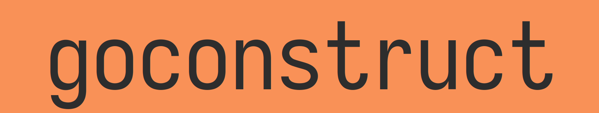

<div align="center">
  <br>
  <p align="center">Go project construction from opinionated templates.</p>

  [![Build Status][build-badge]][build-url]
  [![GoDev][godev-badge]][godev-url]
  [![License][license-badge]][license-url]
  [![codecov][codecov-badge]][codecov-url]
  [![Release][release-badge]][release-url]
</div>

[build-badge]: https://github.com/mccurdyc/goconstruct/workflows/build-test/badge.svg
[build-url]: https://github.com/mccurdyc/goconstruct/actions
[godev-badge]: https://pkg.go.dev/badge/github.com/mccurdyc/goconstruct
[godev-url]: https://pkg.go.dev/github.com/mccurdyc/goconstruct?tab=overview
[license-badge]: https://img.shields.io/github/license/mccurdyc/goconstruct
[license-url]: LICENSE
[codecov-badge]: https://codecov.io/gh/mccurdyc/goconstruct/branch/master/graph/badge.svg
[codecov-url]: https://codecov.io/gh/mccurdyc/goconstruct
[release-badge]: https://img.shields.io/github/release/mccurdyc/goconstruct.svg
[release-url]: https://github.com/mccurdyc/goconstruct/releases/latest

## Overview

goconstruct provides a way to construct Go projects from opinionated, templated,
components.

My goal with this project, specifically with the templates is to "document"
the opinions that I have in the form of templates that can be shared and used by
others or minimally, referenced in code reviews. While these opinions are my own,
they have absolutely been influenced by the work of others.

## Installing

```sh
(
  d=$(mktemp -d) cd $d
  go get -u -v github.com/mccurdyc/goconstruct
)
```

## Usage

```sh
% goconstruct project -h
USAGE
  project <subcommand>

SUBCOMMANDS
  generate  Generates a new project.

FLAGS
  -config config.toml       A config file defining values for the required variables for all templates used.
  -destination .            The destination directory where the project should be created.
  -templates glue           A comma-separate list of template names.
  -templates-path ./_tmpls  Path to templates.
```

## Contributing

+ [Check out the CONTRIBUTING document.](./CONTRIBUTING.md)

## License

+ [GNU General Public License Version 3](./LICENSE)

[](https://app.fossa.io/projects/git%2Bgithub.com%2Fmccurdyc%2Fgoconstruct?ref=badge_large)

## TODOs

1. Handle `goconstruct` with missing subcommands.
1. GitHub Action for CI (build and test).
1. Simplify each template so that they are more composable and align with the Unix philosophy of doing one thing.
1. Backport changes to goconstruct to the template files.
1. Render templated filenames.
1. Configurable template delimeters.
1. Move templates to a separate GitHub repository.
1. Generate README usage section via Make target or something.
